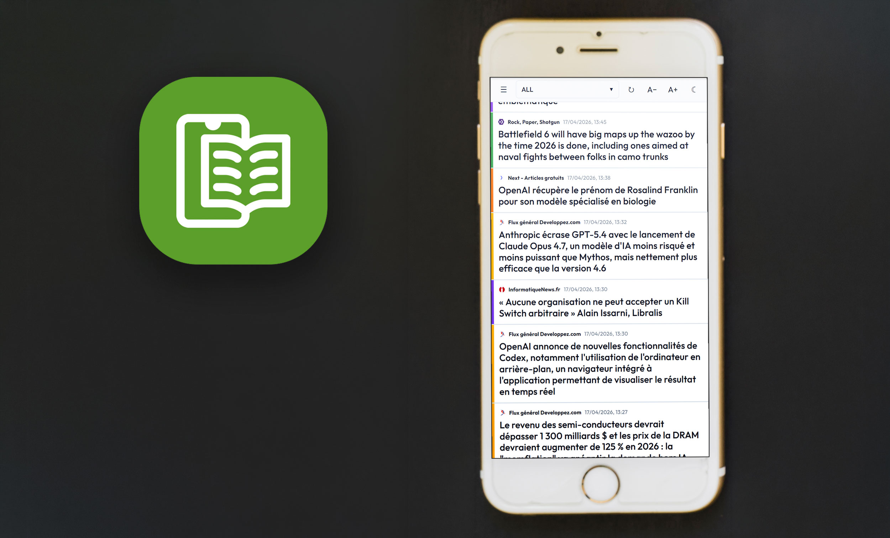

# OpenFeed

OpenFeed is a client-side RSS/Atom feed reader built as a Progressive Web Application (PWA). It stores all data locally in the browser using IndexedDB and requires no backend server.



## Features

- **Local Storage**: Uses IndexedDB for persistent storage of feeds and articles.
- **Protocol Support**: Compatible with RSS 2.0 and Atom formats.
- **OPML Management**: Provides tools for importing and exporting subscriptions via OPML files.
- **Customizable Interface**: Dynamic font scaling and theme switching (Light/Dark).
- **Automated Organization**: Feeds are automatically sorted alphabetically.
- **CORS Proxy**: Utilizes a Cloudflare Worker to bypass Cross-Origin Resource Sharing (CORS) restrictions.

## Technical Architecture

The application is built using the following technologies:
- **Frontend**: React 19, Vite 8, TypeScript.
- **Database**: IndexedDB via the `idb` library.
- **Parsing**: `fast-xml-parser` for feed processing.
- **Proxy**: Cloudflare Workers for reliable fetching.
- **Styling**: Vanilla CSS for layout and design.

## Installation and Setup

### 1. Cloudflare Worker Deployment
The worker acts as a proxy to fetch feeds that do not provide CORS headers.

```bash
cd worker
npm install
npx wrangler deploy
```
After deployment, take note of the generated worker URL.

### 2. Environment Configuration
Create a `.env.local` file in the project root with the following variable:
```env
VITE_WORKER_URL=https://your-worker-url.workers.dev
```

### 3. Local Development
```bash
npm install
npm run dev
```

## Deployment

This project is configured for automated deployment to GitHub Pages via GitHub Actions.
1. Configure `VITE_WORKER_URL` as a repository secret.
2. Changes merged into the `main` branch will trigger an automatic build and deployment.
